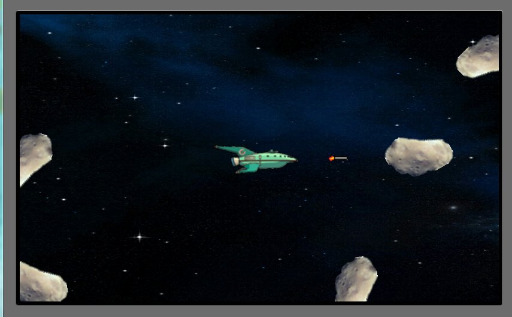

Asteroids
---------
The famous asteroids game made application for android 4.4.2

Developed under Eclipse IDE and Android 4 SDK (the most stable version when the app was developed). It was part of the course "Android: programación de aplicaciones", organized by the Polithecnic University of Valencia and the MiriadaX MOOC platform.

The application has a responsive design, its views adapt automatically to the screen of the device.

Screenshot of the main menu of the game.

   
Screenshot of the game main activity.
